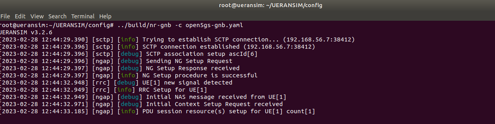

{width="3.743682195975503in"
height="1.515624453193351in"}

Mobile Computing Project

### WiSe 2022/2023

##### Group 17

Submitted by

Syed Mostain Ahmed (1390214)

Debasish Dutta (1343753)

Farjana Akter (1344037)

**Content**

1.  **Introduction**

2.  **Project Prerequisite**

3.  **Project Planning**

4.  **Project Implementation**

    1.  **Virtual Box**

    2.  **Open5gs**

    3.  **Setup a 5G Core**

    4.  **Registering Subscriber Information**

    5.  **Configuration of srsRAN with ZMQ Virtual Radios**

    6.  **5G SA End-to-End**

    7.  **Testing the Network**

5.  **Conclusion**

6.  **References**

**1. Introduction**

5G is a next-generation mobile network technology that builds on the
foundation laid by 1G, 2G, 3G, and 4G networks. One of its main
advantages is its ability to efficiently connect a vast number of
devices, machines, and objects. 5G offers several benefits over previous
networks, such as faster peak data speeds, much lower latency, greater
reliability, increased network capacity, improved availability, and more
consistent user experience. These benefits are achieved through the use
of higher frequency bands and advanced technologies like MIMO and
beamforming that maximize efficiency and capacity.

The goal of this project is to implement a Service-Based Interface using
srsRAN/UERANSIM, which will enable the creation of a platform for
internet connection, file sharing, streaming, and SIP-call services. To
achieve this, a 5G-SA system has been provisioned using Open5GS, with
srsRAN serving as the 5G Radio Access Network (RAN). VirtualBox and
UERANSIM have been used to enable running and hosting of the project.
GitHub has been utilized for version control, while Kamailio has been
used for establishing a SIP Call Server. Additionally, Owncast has been
used for the streaming platform, and NextCloud has been used as the file
sharing platform.

In summary, the project aims to leverage 5G technology to create a
platform that provides a variety of services using a Service-Based
Interface, with srsRAN/UERANSIM serving as the backbone of the system.
The various tools and technologies mentioned above have been employed to
facilitate the implementation of the project.

**2. Project Prerequisite**

For establish this 5G network, specific requirements are as follows:

1\. Open5gs

2\. srsRAN

3\. UERANSIM

4\. ZeroMQ

As it turned out, srsRAN does not support the configuration of the
slices, which does not allow the achievement of the project goal. For
this reason we integrated srsRAN without specific slices (simple access
to the data network).

Proposed network slices are:

{width="6.263888888888889in"
height="1.4in"}

Proposed project architecture:

{width="6.167999781277341in"
height="2.8881944444444443in"}

**3. Project Planning**

Step 1: Installing the required database(MongoDB)

Step 2: Building open5gs core.

Step 3: Configure open5gs for external connection to user equipment by
editing AMF and UPF.

Step 4: Installing webUI for open5gs to add subscriber.

Step 5: Configure TUN devices to tunnel the incoming network.

Step 6: Create a script to add required IP addresses, TUN devices and
restarting open5gs.

Step 7: Creating virtual Radio Towers through ZeroMQ such as eNB with
srsRAN.

Step 8: Virtual user equipment with the help of srsRAN.

Step 9: Building connection from user equipment to open5gs core.

Step 10: UERANSIM to create user equipment and gNB.

Step 11: Configuration of UERANSIM's ue and gNB configuration file.

Step 12: Create SCTP connection between open5gs core and Gnb

Step 13: Create RRC connection between ue and gNB.

Step 14: Calling between Kamailio SIP call server and open5gs.

Step 15: NextCloud platform to share files in our 5G network.

Step 16: Owncast as streaming platform.

**4. Project Implementation**

**4.1 Virtual Box**

We started with the installation of VirtualBox in which we used Ubuntu
machines to setup and implement our desired network.

**4.2 Open5gs**

Also the installation of open5gs with a package manager. Originally, we
installed the MongoDB package as a reliance for open5gs, imported the
public key used by the package operation system, also created the list
/etc/apt/sources.list.d/mongodb-org-6.0.list. Installation of the
database is crucial as all the necessary data i.e.. Subscribers will be
stored here.

Running the MongoDB

{width="6.263888888888889in"
height="1.8243055555555556in"}

Figure 4.2.1: Active MongoDB.

Installing Open5GS through these commands as shown below.

\$ sudo add-apt-repository ppa:open5gs/latest

\$ sudo apt update

\$ sudo apt install open5gs

**4.3 Setup a 5G Core**

It leads us to configure open5gs, demanding to modify our 5G AMF config
to support PLMN and TAC. The transnational test PLMN is 901/70, and the
transnational private network PLMN is 901/70. We should stick to using
either of these PLMNs unless issuing a PLMN by the public controller. (
This PLMN needs to be configured in gNB). For connect an external gNB to
the core, the NGAP binds address of the AMF and the GTPU bind address of
the UPF. It is absolutely crucial to make sure that the amf.yaml and
upf.yaml are configured properly. Otherwise, UEs cannot connect with the
open5gs core. In our case, as we ran both srsRAN and open5gs core on a
single VM, we kept the NGAP and MME address of amf.yaml and upf.yaml
respectively.

Modifying /etc/open5gs/amf.yaml to set the NGAP IP address, PLMN ID, TAC
and NSSAI.

{width="6.2623304899387575in"
height="3.208000874890639in"}

Figure 4.3.1 : amf.yaml file modification.

Modifying /etc/open5gs/upf.yaml to set the GTP-U address.

{width="6.263888888888889in"
height="3.7756944444444445in"}

Figure 4.3.2: upf.yaml file modification.

After changing config files, restarting open5gs daemons.

\$ sudo systemctl restart open5gs-amfd

\$ sudo systemctl restart open5gs-upfd

Command bash script to run open5gs and TUN devices.

\$ sudo ip tuntap add name ogstun mode tun

\$ sudo ip addr add 10.45.0.1/16 dev ogstun

\$ sudo ip addr add 2001:db8:cafe::1/48 dev ogstun

\$ sudo ip link set ogstun up

Running open5gs with custom net.sh.

{width="6.254851268591426in"
height="2.9833333333333334in"}

Figure 4.3.3: Active open5gs.

**4.4 Registering Subscriber Information**

Multiple methods for managing subscribers include logging into an admin
account on the web application via http://localhost:3000. From the admin
dashboard or management interface, administrators can manage subscriber
information such as adding or removing subscribers, updating their
contact details, and managing subscription plans.

{width="6.263888888888889in"
height="3.20799978127734in"}

Figure 4.4.1: Adding subscriber to open5gs with predefined
configuration.

Adding subscriber through terminal.

{width="6.2623162729658794in"
height="3.1277777777777778in"}

Figure 4.4.2: A subscriber to open5gs with predefined configuration.

**4.5 Configuration of srsRAN with ZMQ Virtual Radios**

The srsRAN 4G software suite provides a comprehensive solution for 4G
and 5G networks. Its 4G network architecture comprises a core network,
eNodeB, and UE implementation. Typically, eNodeB and UE are used with
physical radios for over-the-air transmissions. However, srsRAN 4G
software suite features a virtual radio that utilizes the ZeroMQ
networking library to transmit radio samples between applications. This
innovative approach is highly beneficial for development, testing,
debugging, continuous integration and deployment, as well as for
educational purposes.

{width="6.25625in"
height="2.9304352580927384in"}

Figure 4.5.1: High-level architecture of srsRAN connecting with open5gs.

Installing the ZeroMQ development libraries on Ubuntu by using the
following command:

\$ sudo apt-get install libzmq3-dev

Before proceeding with any further steps, it is necessary to install
libzmq.

{width="3.6608694225721785in"
height="1.2347222222222223in"}

Secondly installing czmq:

{width="4.552083333333333in"
height="1.2722222222222221in"}

Assuming all the necessary dependencies have already been installed, the
final step involves compiling srsRAN. If srsRAN was built and installed
before installing ZMQ and other dependencies, you must run the make
command again to ensure srsRAN recognizes the addition of ZMQ.

{width="3.8402777777777777in"
height="1.0159722222222223in"}

It is important to carefully review the output displayed in the cmake
console.

{width="4.584027777777778in"
height="1.136111111111111in"}

**4.6 5G SA End-to-End**

In order to enable 5G SA features, specific steps must be taken to
modify the srsUE config file. These steps include enabling ZMQ, enabling
NR features, and configuring USIM credentials and APN. To enable ZMQ,
certain modifications need to be made to the UE config file, and the
network namespace must also be configured accordingly. Additionally,
enabling eNB is also necessary.

{width="6.263888888888889in"
height="3.479861111111111in"}

Figure 4.6.1: Configuration of srsUE.

To make the necessary changes, begin by disabling the LTE carrier or
carriers. Next, enabling the NR band or bands and carriers. Finally,
ensure that the release is set to release-15.

{width="6.263888888888889in"
height="3.504166666666667in"}

Figure 4.6.2: Sample rate set to 11.52e6.

{width="6.25625in"
height="3.4479166666666665in"}

Figure 4.6.3: NOF carriers configuration.

The USIM credentials to be used are provided, with the main modification
being the adjustment of the IMSI to ensure the correct PLMN is utilized.
The APN is configured and it is essential to create the relevant network
namespace for the UE when ZMQ is employed.

To establish the network namespace, the following procedure:

\$ sudo ip netns add ue1

To confirm that the newly created \"ue1\" netns exists:

\$ sudo ip netns list

{width="6.25625in"
height="3.5118055555555556in"}

Figure 4.6.4: USIM configuration added.

To enable 5G SA features in srsENB, several modifications must be made
to the configuration files. Firstly, in the enb.conf file, the correct
PLMN must be set, and the MME address must be changed to match the
Open5GS GTPU and NGAP address. Additionally, ZMQ must be enabled.

To set the PLMN (MCC & MNC) and MME address, the MMC and MNC must match
the UE and Core, and the MME address must be configured to facilitate
proper communication between the eNB and AMF/UPF. Failure to change
these settings will result in srsENB and the Core being unable to
connect.

In the rr.conf file, a 5G cell must be added to the cell list, and any
LTE cells must be removed.

To enable ZMQ, the rr.conf file must be modified by adding the 5G NR
cell configuration and removing any existing LTE cells. This can be
accomplished by either commenting them out or deleting them completely.

After following the steps in the Open5GS Quickstart Guide, there is no
need to perform any additional steps to bring the core online. It will
run in the background, but it is important to restart the relevant
daemons after making changes to the config files.

To start srsENB, run it directly from the build folder with the
associated config files. If srsENB successfully connects to the core, a
message similar to the one displayed on the console will appear.

{width="6.25625in"
height="3.520138888888889in"}

Figure 4.6.5: Release version changed.

When srsENB successfully connects to the core, a message similar to the
following will appear on the console.

{width="6.263888888888889in"
height="2.6880008748906388in"}

Figure 4.6.6: RRC connected and UE attached.

After successful connection to the core, the NG connection successful
message indicates that srsENB has established the connection.

Next, srsUE can be launched directly from the build folder with the
associated config file located in the same directory.

\$ sudo ./srsue ue.conf

When srsUE successfully connects to the network, a message similar to
the following will appear on the console.

{width="6.25625in"
height="3.879861111111111in"}

Figure 4.6.7: Connection of UE to 5G core network.

The successful establishment of the connection is indicated when the UE
is assigned an IP, as shown in the message \"PDU Session Establishment
successful. IP: 10.45.0.2\". After this, the NR connection is verified
by the message \"RRC NR reconfiguration successful.\"

{width="6.263888888888889in"
height="0.5520833333333334in"}

Figure 4.6.8: Connection ping statistics.

**4.7 Testing the Network**

PING is a simple method to verify if the UE and core are able to
communicate successfully.

To test the uplink connection, the following method:

\$ sudo ip netns exec ue1 ping 10.45.0.1

{width="6.261805555555555in"
height="4.582608267716536in"}

Figure 4.7.1: Ping to uplink network.

To test the downlink connection, the below method:

\$ sudo ip netns exec ue1 ping 10.45.0.5

{width="6.261032370953631in"
height="4.669564741907261in"}

Figure 4.7.2: Testing downlink network.

{width="6.263888888888889in"
height="4.052174103237095in"}

Figure 4.7.3: Uplink stack trace.

{width="6.25625in"
height="4.047916666666667in"}

Figure 4.7.4: downlink stack trace.

{width="6.263888888888889in"
height="2.0083333333333333in"}

Figure 4.7.5: UE attaching to 5G core.

{width="6.263888888888889in"
height="0.32013888888888886in"}

Figure 4.7.6: UE detaching to 5G core.

{width="6.269444444444445in"
height="4.0in"}

Figure 4.7.7: Connection between open5gs core and gNB(UERANSIM).

{width="6.269444444444445in"
height="3.9652777777777777in"}

Figure 4.7.8: gNB connected to open5gs.

{width="6.261111111111111in"
height="2.4868055555555557in"}

Figure 4.7.9: Tshark capture of gNB and open5gs.

{width="6.261111111111111in"
height="1.5652777777777778in"}

Figure 4.7.10: Log from gNB.

{width="6.261111111111111in"
height="2.6173611111111112in"}Figure 4.7.11: RRC connection successful
from UE to gNB.

{width="6.261111111111111in"
height="1.573611111111111in"}

Figure4.7.12: Log from gNB of RRC connection.

{width="6.261111111111111in"
height="1.7215277777777778in"}

Figure 4.7.13: UE connected to open5gs core through gNB(UERANSIM).

**5. Conclusion**

In the end, we successfully accomplished our project\'s primary goal of
connecting user equipment to the open5gs core using srsRAN and creating
a network between UEs and the open5gs core with specific network slices.
While we fell short of achieving additional project goals, such as
implementing file sharing, streaming, and SIP call server
functionalities, we are optimistic that these objectives can be pursued
and achieved in future work.

6.  **References**

Open5GS, 2022. Open5GS. \[Online\] Available at: https://open5gs.org/

Cox, C., 2021. An introduction to 5G. Hoboken: John Wiley & Sons, Inc..

GitHub, Inc., 2022. GitHub. \[Online\] Available at:
https://github.com/.

GÜNGÖR, A., 2022. UERANSIM. \[Online\] Available at:
https://github.com/aligungr/UERANSIM.

Kamailio, 2022. Kamailio SIP Server. \[Online\] Available at:
https[://w](http://www.kamailio.org/)ww.[kamailio.org/](http://www.kamailio.org/)

NextCloud, 2022. NextCloud - Online Collaboration Platform. \[Online\]
Available at: https://nextcloud.com/.

Oracle, 2022. VirtualBox. \[Online\] Available at:
https[://w](http://www.virtualbox.org/)ww.[virtualbox.org/.](http://www.virtualbox.org/)

Owncast, 2022. Owncast - Free and Open Source Livestreaming. \[Online\]
Available at: https://owncast.online/

SRSRAN, 2022. SRSRAN. \[Online\] Available at: https://docs.srsran.com/

Stallings, W., 2021. 5G wireless : a comprehensive introduction. Boston;
Columbus; New York; San Francisco; Amsterdam; Cape Town; Dubai; London;
Madrid; Milan; Munich; Paris; Montreal; Toronto; Delhi; Mexico City; São
Paulo; Sydney; Hong Kong; Seoul; Singapore; Taipei; Tokyo:
Addison-Wesley.

Trick, U., 2021. 5G - An Introduction to the 5th Generation Mobile
Networks. De Gruyter STEM ed. Berlin/München/Boston: De Gruyter
Oldenbourg.
